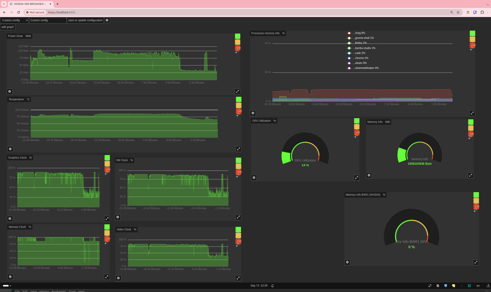

# Browser GPU Monitor

# Installation 
## install denojs 

`curl -fsSL https://deno.land/install.sh | sh`
or
`nix-shell -p deno`
or
`asdf plugin-add deno https://github.com/asdf-community/asdf-deno.git

# Download and install the latest version of Deno
asdf install deno latest

# To set as the default version of Deno globally
asdf global deno latest

# To set as the default version of Deno locally (current project only)
asdf local deno latest
`
or 
`vfox add deno

# Download and install the latest version of Deno
vfox install deno@latest

# To set the version of Deno globally
vfox use --global deno
`
or more installation options on https://docs.deno.com/runtime/fundamentals/installation/

## install nvidia-smi or
`sudo apt install nvidia`
## or amdgpu_top
`sudo apt install amdgpu_top`

# Running / starting it 
`deno run -A websersocket_0628a90e-0163-400d-bee6-e31e990e9197.js`
then hit enter a few times to generate a self signed certificate (needed for local https server...)

finally visit : https://[yourcomputername]:8443

